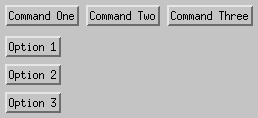
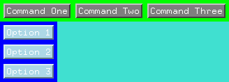

This main.go is an example on X11 resources.

## Build executable ch03-editor
```shell
go build .
```
Result is executable ch03-editor.

## Apply resources
Resource file is named [Editor](Editor)

Load these resources with
```shell
xrdb -m Editor
```

ch03-editor program without any loaded resources:




ch03-editor program with resources loaded from file "Editor":


